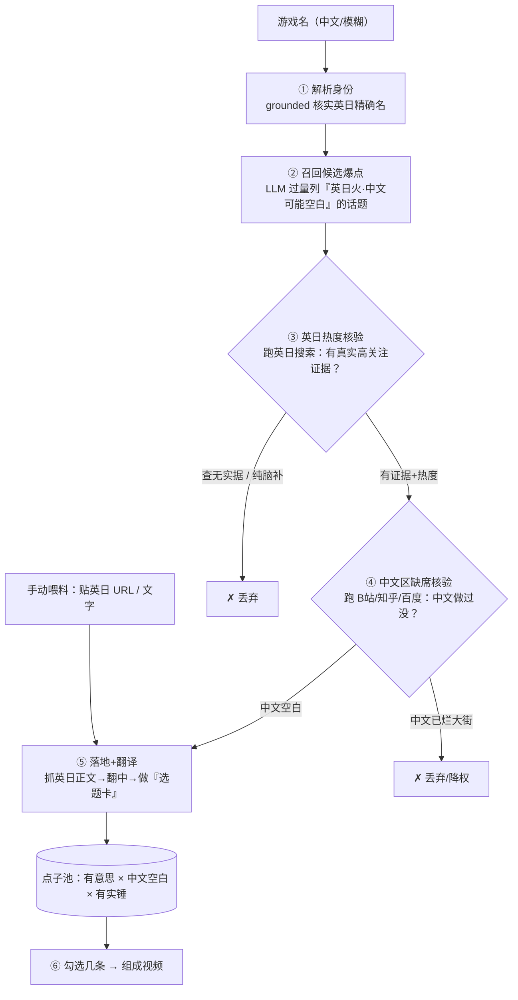

# youtube_topic v3 — 跨区注意力落差雷达

> 2026-06-23 重新设计。v2（物证驱动自底向上挖 TCRF/采访）已废弃——它优化了"接地"却丢了"有意思"，产出一地 trivia。本文是 v3 的完整设计。

## 1. 一句话定位

把**英/日圈已经被真人验证"有意思"、但中文区还空白**的老游戏爆点，成规模地翻译、坐实、端到创作者面前。

## 2. 为什么是这个方向（核心推理）

**一条定律：有意思 → 会被讨论。** 一个既够炸又好找的爆点，早就被人做成视频了。所以「有意思」和「没人做过」天生互斥——除非有一道**屏障**挡住了"有意思"扩散成"被讨论"。

屏障只有三种：
1. **语言/地区屏障**：英日圈火、中文区没人搬。← 创作者两个爆款（Gorochu=日文读卖采访、Triforce%=英文速通圈）都是这种。**主攻这个。**
2. **媒介屏障**：埋在视频/采访/绝版书里，没成可检索文字。（顺带覆盖）
3. **连接屏障**：两个已知事实没人连起来——靠人的洞察，**工具替不了，留给创作者**。

推论：工具**不"凭空想爆点"**（那要么不存在、要么是 trivia）。工具做的是**套利**——"有意思"外包给**英日真人的注意力**，"新"外包给**中文区缺席的实测**，"真"由"英日有讨论=有源可翻"顺带保证。

**LLM 的角色**：只是「召回器 + 翻译器」，**不是真理来源**。它召回的每一条候选，**不过英日热度核验 + 中文缺席核验两道外部关，一律毙**。这样既拿回脑洞版的"有意思"，又用两道关挡住它的烂大街和瞎编。

## 3. 总流程图

## 4. 每步 I/O（流水线核心，逐步写死）

### ① 解析身份 `resolve`
- **输入**：用户给的模糊游戏名（中文，常歧义）
- **内部**：grounded websearch 核实身份，**绝不凭印象编英文名**（中文名直译常错）
- **输出**：`identity = { en, jp, aliases[], year, dev, platform, series, characters:[{en,jp}], confidence }`

### ② 召回候选爆点 `recall`（LLM=召回器，产假设不产结论）
- **输入**：`identity`
- **内部**：LLM 凭对英日游戏圈的了解，**过量**列出"在英/日圈被讨论过、够炸、且**很可能中文区还没做**"的候选。【刻意偏英日硬核圈、主动避开全球烂大街】。每条自标置信度。
- **输出**：`candidates[] = { claim, whyBang, guessSource(速通圈/开发者采访/datamine/都市传说/媒体报道/…), enQueries[], jpQueries[], priorConfidence(确定真|听过需核实|可能脑补) }`
- **注**：这步不产生任何"结论"，只产生"去哪验证"的线索。LLM 说什么都不算数，等③④裁决。

### ③ 英日热度核验 `verify-attention`（外部真理来源 1 = "有意思"）
- **输入**：每条 `candidate` + 它的 `enQueries/jpQueries`
- **内部**：跑英日 websearch，找**真实高关注度的证据**：大频道视频(看播放量)、速通记录、采访原文、datamine/TCRF 条目、Reddit/2ch 讨论、媒体报道。抓到证据链接 + 正文片段 + 热度强弱。
- **输出**：每条 → `{ verified:bool, attention:{evidenceUrls[], signal:高|中|低}, rawMaterial(英日正文) }`
- **裁决**：`verified=false`（英日也查无实据 = LLM 脑补）→ **丢弃**。这步把"有意思"外包给英日真人，不靠 LLM 自评。

### ④ 中文区缺席核验 `verify-gap`（外部真理来源 2 = "新"）
- **输入**：通过③的候选
- **内部**：跑中文 search（B站 / 知乎 / 百度），估中文区覆盖度
- **输出**：每条 → `{ cnCoverage: 空白|零星|烂大街, cnLinks[] }`
- **裁决**：`烂大街` → **丢弃或重降权**；`空白/零星` → 套利分↑。这步把"新不新"外包给中文区实测，杀掉全球&中文烂大街（Polybius、负1关在这里死）。

### ⑤ 落地+翻译 `land`
- **输入**：过两关的候选 + ③抓到的英日 `rawMaterial`
- **内部**：抓全英日正文/字幕/采访 → 翻成中文（**逐字保留日文原句 + 附中译**）→ 整理成"选题卡"。需字节级坐实的（被砍内容/数值）→ **可选**回 TCRF/decomp 验证（**仅此处、仅验证**）。
- **输出**：`finding(选题卡) = { titleCn(钩子标题), claim, evidence:[{quote, zh, url, source}], attentionSignal, cnGap, watchability(=套利分), verifyNext }` → **自动进点子池**

### ⑥ 点子池 / 组视频（沿用 v2 简化版）
- 点子全自动进池（按 game+title 去重、按游戏筛选）；勾选几条（可跨游戏）→ `pCompose` 导演成一集。
- **手动喂料**：贴英日 URL/文字 → 直接进⑤（翻译+做卡）→ 进池。

## 5. 数据模型（增量）

- `finding`：`{ game, titleCn, claim, family?, evidence:[{quote,zh,url,source}], attentionSignal(高|中|低), cnGap(空白|零星), watchability, verifyNext, origin(radar|feed), status }`
- `run`/`DAG`：沿用 v2 留痕可视化（每步 input/output/logs，前端画流程图、可回看）。DAG 节点 = ①…⑤。

## 6. 复用 vs 砍掉（v2 设施去哪了）

**复用**：runs/DAG 留痕可视化、点子池/组集/手动喂料、`claude.js`（grounded 搜索 + 翻译，含 cwd:tmpdir / sonnet / effort 这些踩过的坑）、`acquire.pageMaterial`（抓正文）、TCRF curl+短UA（降级为⑤的可选字节验证）。
**砍掉**：5 源 map-reduce 发现、`pExtractCandidates` 当发现器（改写成⑤的翻译整理）、把 TCRF/采访当**主发现源**、watchability=「事实冷不冷」的评分（改为「套利分」=英日热度×中文缺席×IP相关度）。
**铁律不变**：decomp/DataCrystal 永远只做验证、不进发现。

## 7. 工具不做什么（诚实边界）

- 不"凭空想出全世界没人知道的爆点"——那要么不存在、要么是 trivia。
- 屏障3（洞察连接）留给创作者；工具最多把翻译好的原料喂到位，让创作者更容易产生洞察。
- **英日也没人讨论的游戏 → 老实返回"无套利空间"**，绝不夹 trivia 凑数（这正是 v2 最大的病）。
- 不会每次都出 Triforce% 级——爆点本就稀有；但会稳定产出"英日火·中文空"的真东西。

## 8. 待定 / 开放问题（实现前需定）

1. **召回盲区**：②的 LLM 召回必然漏掉"LLM 不知道的深度日文套利"。是否在③加一路**主动搜英日 attention-dense 源**（DYKG/速通榜/日访谈聚合站）来补盲区？（= 把召回从"LLM 记得的"扩到"搜得到的"）
2. **"中文区缺席"怎么量化**：B站搜索结果数/播放量阈值？需实测校准什么算"烂大街 vs 零星 vs 空白"。
3. **"英日热度"阈值**：多大算"被验证有意思"？需校准。
4. **性能/成本**：每条候选要跑英日+中文多次搜索，N 条 = N×多次搜索。需控候选量、并发上限、结果缓存。
5. **B站/知乎 可搜性**：grounded websearch 能不能可靠搜到中文平台覆盖度？搜不到则④失真，需备用方案（如指定 site: 搜索）。
